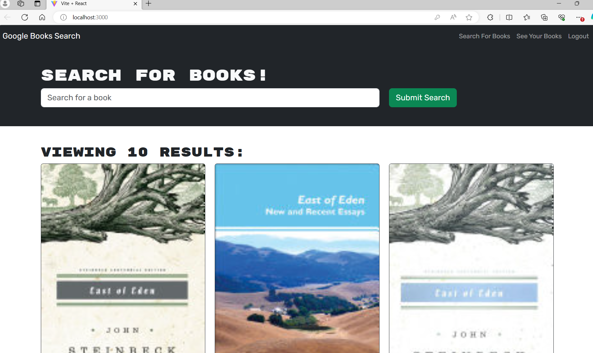
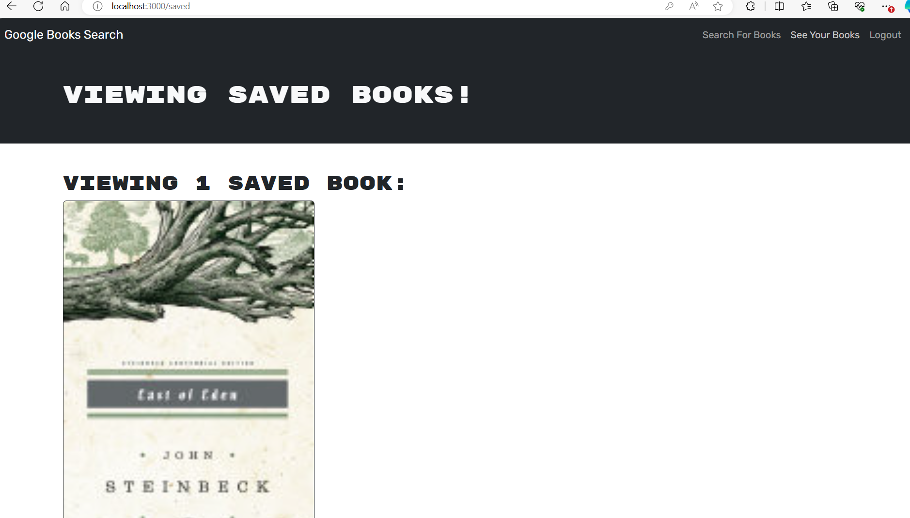

# AnnaK-book-search-engine

## Description

My goal was to refactor the Google Books API search engine built with a RESTful API to be a GraphQL API built with Apollo Server.

## Installation

1. Use the command line to navigate the directory of the application
2. Clone my repo to your computer: "git clone [insert the repo's link]"
3. Access to the folder: "cd AnnaK-book-search-engine"
4. Install some necessary packages: "npm install"
5. Run the server: "npm run develop"

## Usage

Access the application at http://localhost:3001

## Link and Screenshot 

To review "AnnaK-book-search-engine", you can click on the link and see the screenshot below:

[Deployed link](https://annak-book-search-engine.onrender.com) 

## Credits

I followed the following resources:

https://react.dev/
https://graphql.org/
https://www.apollographql.com/docs/apollo-server/
